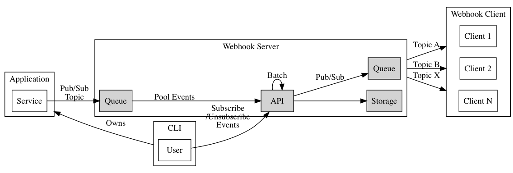
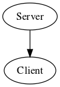
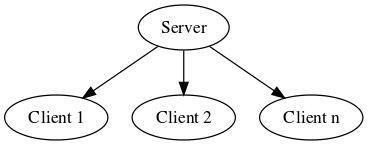
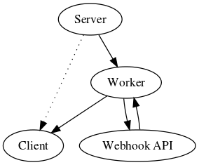
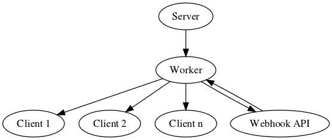
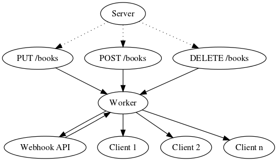

# go-hook




A webhook server that makes it easy to send events from your API Server to clients that subscribes to the topic. The initial goal is to make integration to existing applications easy and to provide a UI/CLI that allows user to subscribe/unsubscribe to specific events.


## Requirements

**Functional requirements:** 
- system should allow users to register new webhook endpoints
- system should send the webhook events when a new event is invoked
- system should ensure one-time delivery only
- system should rate-limit the number of requests send
- system should retry the delivery for a certain amount of time
- system should mark the number of failed delivery attempts
- system should register new client endpoints seamlessly
- system should not care about the ordering of events published

**Non-functional requirements:**
- system should be highly available, no messages should be dropped
- system should be resilient, messages are persisted in a storage
- system should be idempotent, the delivery should not change the state of the payload

## Flow

The depicts the scenario where a user register an endpoint with the webhook server:

1. The _Book Server_ handles book creation, update and delete. 
2. _User A_ wants to subscribe to new book events.
3. _Book Server_ has the `POST /books` endpoint registered with the webhook server and is sending events regularly when a new book is created.
4. _User A_ register a POST endpoint of this server, `POST /receive-events` with a valid API Key.
5. When someone create a new book, message is send from _Book Server_ to _Webhook Server_. _Webhook Server_ will then send the message to all endpoints registered. 
6. _User A_ receives a new event at the `POST /receive-events endpoint`.


## Components

I realize the components naming convention should be the same as the interface naming convention, using words the suffix `-er`. `-er` in the sense of writ-er, bak-er, is the agentive suffix. It turns a verb into a noun that refers to the agent that performs that verb.


**EventCreator:** The service that is responsible for producing the events. It will call the **Worker** to process the requests asynchronously.
**Worker:** The worker receives events from **EventCreator**, and is responsible for sending the messages to **Subscriber**.
**Subscriber:** Clients that subscribes to the webhook event. The list is dynamic, and the client can only receive events the moment they are subscribed.
**Registrator:** The place to register new client endpoints. The registrator provides APIs for clients to add/remove the webhook endpoints dynamically. The registrator will dynamically dispatch the new endpoints to the workers through pub/sub to notify them of the new endpoints.

## Design

## Naive Webhook



In the naive webhook, the _server_ publishes the events **directly** to the client. The events can be _create_, _update_, _delete_ or other event sourcing events. The event is published using a `POST` request. This design is not desired for two reason - one, the server needs to know the client it is sending too, and does not scale when clients can be added/removed dynamically. Also, it violates the single responsibility principles. Second, the delivery should be asynchronous, not synchronous. A better way is to send the message to a persistent queue first, so that any failures can be retried. Note that in some case, it is better to just drop the message than retrying as we want to avoid sending the same message twice.



When the number of clients are increasing, it becomes considerably harder to manage them. Aside from that, the server is knowing too much about the clients. It is best to isolate the logic when you are managing many clients.

## Improved Webhook



The events will still be sent from the Server to the Client, but through the worker instead. The Worker will receive the events through a queue, which increases reliability of the system. The worker will communicate with the Webhook API to validate the subscribers before sending the payload.



When the number of clients increases, the Worker can be scaled independently too.




In the diagram above, the server registers three different endpoints (`PUT /books`, `POST /books`, `DELETE /books`) that will publish the payload to the Worker. Clients can then choose to subscribe to these events through the UI or CLI by passing them the callback url.

## Pseudo-code

The server endpoint that is registered to the webhook server may perform the following:

```python
def service():
  # Business logic, e.g. create books
  # At the end, we want to deliver this event to the subscribers. The code below will send the payload to the queue.
  webhook.send(topic="new_book", msg=newbook)
```

And this is how the webhook server will pool for the events. A _pull model_ will keep pooling for new events, a _push model_ is a more event-driven system and will be triggered whenever new events are created:
```python
def worker():
  # Pool events
  while True:
    topic, msg = webhook.receive()
    
    # Check for subscribers for this topic. The result will be a bunch of uris where a POST request will be executed.
    uris = getSubscribersUris(topic)
    
    # This can be run in a separate thread.
    for uri in uris:
      try:
        # The body response should be empty. Do validation to ensure subscribers are not sending payload.
        result, body = request(method="POST", uri=uri, body=msg)
        if result.code == 200:
          # Mark as delivered. Update delivery status for metrics.
        else:
          # Retry for n-times before marking as failed.
      except e:
        # If error keeps repeating for the same uri for a certain threshold, remove the uri.
        pass
```

This is how a user might register his endpoint at the **Registrator** to receive subscription:

```bash
$ curl -XPOST -d '{"topic": "new_book", "callback_uri": "http://localhost:4000/receive-events"}' https://webhook.server/webhooks
```

The webhook api should check for the following:
- only valid uris can be registered.
- the uris should be available during registration by invoking a simple post with a registration token.
- the registered endpoint should not return any response in the body.

An example on how the registrator may look like:

```python
def register():
  let body = {
    "topic": "new_book",
    "callback_uri": "http://localhost:4000/receive-events"
  }
  // Should throw error when params are invalid.
  validate(body)
  
  // Attempt to call the endpoint to validate that it exists. Also, it will send a registration token alongside
  // which needs to be send back to the server to validate the authenticity of the client.
  res = request(body.callback_uri)
  if res.code it not 200:
    error("invalid")
  
  // Store to the database first.
  create(body)

def authz():
  let body = {"token": "token_from_request"}
  if not valid(body.token):
    error("invalid token")
  acknowledge(body.token)
```

The user should then create a client to receive events from:

```js
const app = require('express')()
app.post('/receive-events', (req, res) => {
  const msg = req.body
  // Do something with the received payload.
  
  // Return status 200 to indicate success, and body must be empty.
  res.status(200).json({})
})
app.listen(4000)
```

## TODO

- use labels instead or environment variables to register services
- use middleware to hook all endpoints

## Thoughts

- the system (server) should support the hooks first (publishing events), without it, there's no way for the user to subscribe to those events. In other words, user can only subscribe to webhook events that are available. One possible idea is to label each services endpoint with a name, and log the events out when it happened, and when streaming the logs, publish it to different subscribers.
- the subscription for different events may differ in count - by a huge margin. Some are definitely more popular than the rest. How to deal with the delivery for such cases?
- to mark the event as delivered, we probably need both a status flag and status timestamp. Status can be retry too if we need to be able to retry it, or due with a due date in the future
- the outgoing events is proportional to the incoming requests, if we have a lot of incoming requests, we need to find a way to smoothen it (leaky bucket?) without compromising speed (if we have 100 req/s, but we are sending it out at 10 req/s, it is not going to scale when the number of requests increases)
- registering, unregistering the events real time is going to take a toll. If the requests are already being processed (since it is in a batch, it's harder to cancel individual events), it could only be unregistered in the next cycle. But having too many updates will slow down the system.
- delivering to multiple endpoints. How to detect if the endpoints are no longer valid and blacklist them? send a token to register the endpoints.
- a subscription endpoint may have many registered endpoints. For every requests sent out, we need to deliver them to N endpoints, which is going to grow in size. Also, those endpoints needs to be kept in memory (?) since querying them all the time is going to be taxing.
- how to deal with status change in webhook events, e.g. for a payment system, the payment status can be `PENDING`, `PAID`, `REJECTED` etc. Do we allow those past events to be queried, and resend?


## References 
- https://dzone.com/articles/producers-and-consumers-part-3
- https://medium.com/hootsuite-engineering/a-scalable-reliable-webhook-dispatcher-powered-by-kafka-2dc3d677f16b
- https://medium.com/ibm-watson-data-lab/build-scalable-webhooks-with-a-queue-and-workers-setup-3b2cbc228220
- https://medium.com/square-corner-blog/stop-using-servers-to-handle-webhooks-675d5dc926c0
- https://workos.com/blog/building-webhooks-into-your-application-guidelines-and-best-practices
